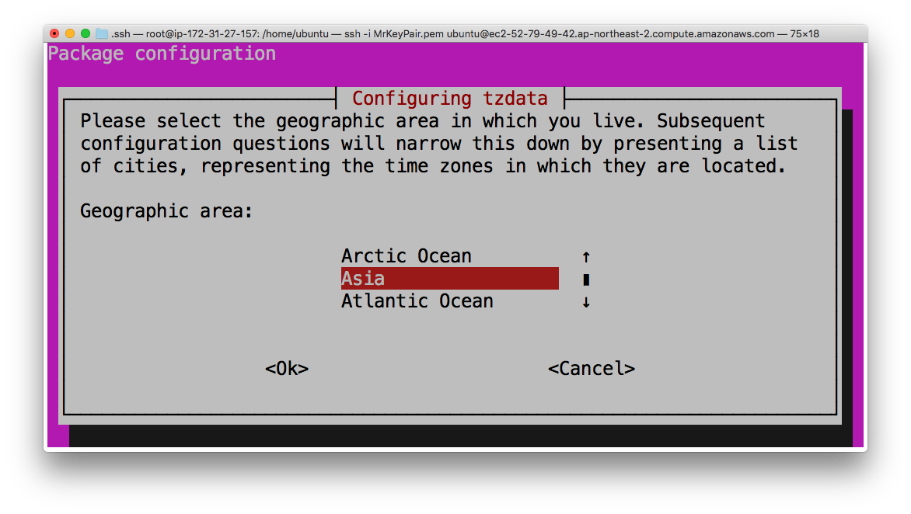
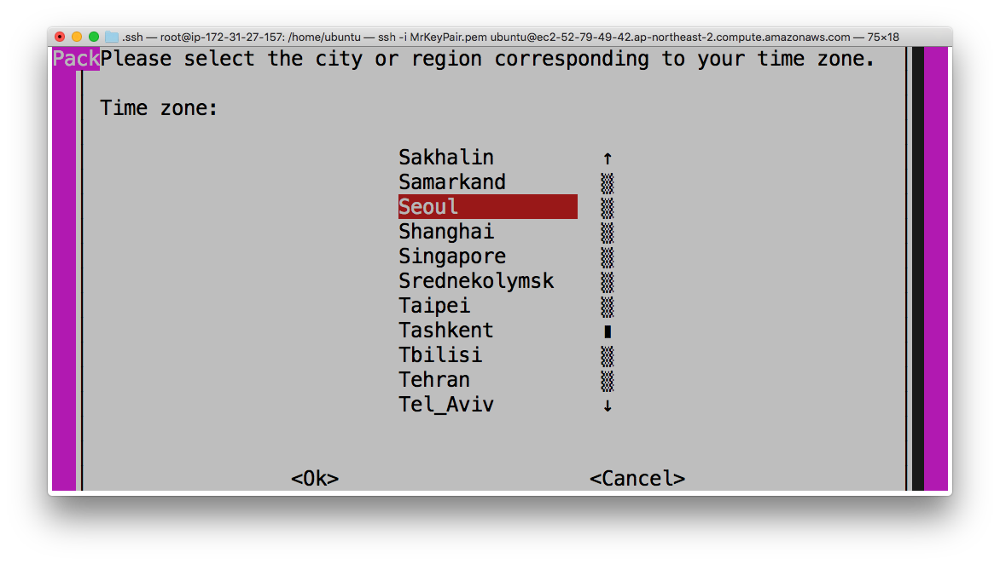
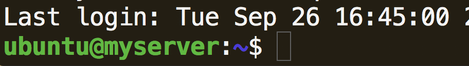

Web server on Ubuntu 18.04
======================

Ubuntu 환경에서의 웹 서버 세팅 방법을 다룬 한국어 메뉴얼입니다.
이 문서는 Ubuntu 18.04 를 사용할 환경을 갖춘 이후를 다룬 가이드입니다. 기본적인 리눅스 명령어에 대한 설명는 제타위키 등에서 검색하시면 찾을 수 있습니다.
Ubuntu 16.04LTS 환경에서의 세팅을 원하시는 분은 [(여기)](ubuntu16.04LTS.md)를 확인해주세요.

# 0. 목차
```
1. 시작
    1-1. root권한 얻기
    1-2. 시스템 패키지 업데이트
2. 시스템 설정
    2-1. 시스템 시간 설정 (권장)
    2-2. Hostname 변경 (옵션)
    2-3. SSH및 FTP Root접속 권한 설정 (옵션/권장하지 않음)
3. Nginx 웹 서버 설치
    3-1. Nginx 설치
    3-2. 권장 설정
4. MariaDB 설치
    4-1. 저장소 추가
    4-2. 설치
    4-3. 기본적인 사용법
    4-4. 권장 설정
5. Node.js 설치
    5-1. 설치
```
# 1. 시작

시스템을 사용하기 위해 관리자(root) 권한을 얻고, 업데이트를 진행합니다.

## 1-1. 시스템 패키지 업데이트
모든 OS를 시작할 때는 업데이트를 먼저 해줍시다. apt는 Ubuntu 에서 프로그램 패키지를 다운로드 하고 설치하는 패키지 관리자입니다. `apt-get --help` 라는 명령을 내리면 설명과 사용법이 나타나니 참고하십시오. Amazon Linux 나 CentOS 등에선 `yum`을 사용하기도 합니다.
리눅스든 윈도우든, 어떤 OS이든 처음 사용할 땐 업데이트를 합니다.
```shell
sudo apt-get update -- 패키지 목록 갱신
sudo apt-get upgrade -- 현재 운영체제에 설치되어 있는 프로그램을 최신 버전으로 패치
```

## 1-2. sudo 유저 생성
`sudo`유저를 생성합니다. AWS의 경우 `ubuntu`라는 이름의 `sudo` 유저가 있어서 귀찮으면 생략해도 됩니다.
```
adduser username  # username 이라는 이름으로 유저 생성
usermod -aG sudo username  # username 유저에게 sudo 권한 부여
```

# 2. 시스템 설정
기본적인 시스템 설정을 합니다.

## 2-1. 시스템 시간 설정 (권장)
```shell
dpkg-reconfigure tzdata
```
이후 나타나는 GUI 설정에서 Asia, Seoul 을 차례로 선택합니다.






## 2-2. Hostname  변경 (옵션)

hostname 파일에는 서버의 이름이 기록되어 있습니다. 이를 이름을 원하는 이름으로 변경합니다. ( 수정하기 위해 키보드의 `i`를 눌러 insert 모드로 들어갑니다.  `esc`를 누르면 모드를 나갈 수 있습니다. `:wq` 를 입력한 후 `enter(혹은 return)`을 입력하면 저장 후 나가기가 됩니다.  vi의 자세한 사용법은 다른 문서를 찾아보십시오.)
```shell
sudo vi /etc/hostname
```

이제 변경한 내용을 적용합니다. 아래 명령어를 입력한 뒤, 서버에 재 접속하면 설정이 적용되어 `ubuntu@myserver`등으로 변경 된 것을 확인할 수 있습니다.
```shell
hostname -F /etc/hostname
```


### 2-3. SSH및 FTP Root접속 권한 설정 (옵션/권장하지 않음)
AWS의 경우, 처음 EC2를 생성하면 ssh및 ftp접속 권한이 ubuntu 유저로만 활성화되어 있고 root 계정 접속 허가는 비활성화 되어 있습니다. 물론 ssh접속을 하면 ubuntu 유저는 sudo 명령을 이용해서 root 권한을 사용할 수 있지만, FTP를 이용할 땐 권한을 얻기 힘들어 불편한 점이 있습니다. `/home/ubuntu` 디렉토리 외에는 FTP를 통해 파일을 추가/삭제/수정할 권한이 없어서 작업시에 불편할 수 있습니다. 그러나 root로 접속하는 것은 보안 상 권장하지 않습니다.

root 권한이나 sudo 명령어를 통해서 sshd_config파일을 vi편집기로 수정합시다.
```shell
vi /etc/ssh/sshd_config
```

`PermitRootLogin` 를 찾아서 yes로 변경해줍니다. 편집기에서 i 를 누르면 insert모드로 들어가 수정이 가능해지고, esc를 누른 뒤 :wq 를 입력하면 저장후 터미널로 돌아옵니다. ( :q 는 나가기, :q! 는 강제로 나가기 입니다. q!의 경우 sudo 권한 없이 수정을 시도했다가 권한이 없어 저장할 수 없을 때 편집을 무시하고 터미널로 돌아갈 때 사용됩니다.) 기존의 `PermitRootLogin` 항목은 주석으로 처리하거나(#을 앞에 써주면 됨) 지워버립시다.


이제 ubuntu 유저의 ssh key를 루트에 복사해줍니다. `/root/.ssh` 디렉토리가 없다면 `mkdir /root/.ssh` 로 생성해줍니다.

```shell
cp /home/ubuntu/.ssh/authorized_keys /root/.ssh/
```

이제 외부에서 ssh및 ftp를 root 계정으로 원격 접속 할 수 있습니다.


# 3. Nginx 웹 서버 설치하기

## 3-1. Nginx 설치
`Ubuntu 18.04` 에서는 `nginx version: nginx/1.14.0 (Ubuntu)`버전이 제공되고 있습니다. 설치하면 자동으로 실행됩니다. 또한 재부팅시 자동실행 되는 것이 기본 설정이라 따로 서비스를 등록해줄 필요는 없습니다.
```
sudo apt install nginx
```
더 최신 버전의 Nginx를 원한다면 저장소를 등록해서 사용합시다.

재대로 설치되었는지 확인하기 위해 버전을 확인합니다.

```shell
nginx -v
```

서버 재시작도 잘 되는지 체크해봅시다.
```shell
service nginx restart
```

nginx는 기본적으로 80 포트를 사용합니다. 웹브라우저를 켜고 서버의 아이피(http://111.222.333.444 등)에 접속해서 동작 여부를 확인합니다. Welcome to nginx! 문구가 뜨면 정상입니다. `apt-get`으로 설치하였을 때, 이 파일의 기본 위치는 `/usr/share/nginx/html/index.html` 입니다.

[trouble shooting]
1) "응답하는 데 시간이 너무 오래 걸립니다." 라며 페이지가 접속되지 않을 때는 포트가 열려있는지 먼저 확인해보세요. nginx의 default port는 80입니다. AWS의 경우, Security group 의 초깃값이 22번 포트만 열려 있습니다. 여기서 80포트를 열면 문제가 해결될 수 있습니다.

## 3-2. 권장 설정
`nginx.conf`의 권장 설정을 적용할 것입니다.. 우선 기본 설정 파일을 백업해둡니다.
```
sudo cp nginx.conf nginx.conf.org
```

이제 본격적으로 설정파일(nginx.conf)를 수정합니다.
```
sudo vi /etc/nginx/nginx.conf
```

```
events {
    ...
    # 한 번에 복수의 접속을 허가합니다.
    multi_accept on;
    ...
}

http {
    #response header에 nginx 버전 표시 여부를 결정합니다.
    #보안을 위해 off를 해줍시다.
    server_tokens off;

    #response header 에 charset 을 부여합니다.
    charset utf8mb4;

    #웹서버에서 수신할 수 있는 최대 패킷 크기를 정의합니다.
    #기본값은 1MB 이며, 더 큰 파일의 업로드를 허용하려면 이 값을 늘려줘야 합니다.
    #원하는 값으로 바꿉니다.
    client_max_body_size 20M;
}
```

수정, 저장 후에 서버를 재시작해줍니다.

```
service nginx restart
```

# 4. MariaDB설치
`MariaDB`를 설치해봅니다.  
`mysql  Ver 15.1 Distrib 10.1.38-MariaDB, for debian-linux-gnu (x86_64) using readline 5.2`이 설치됩니다.

## 4-1. 저장소 추가
```
sudo apt-get install software-properties-common
sudo apt-key adv --recv-keys --keyserver hkp://keyserver.ubuntu.com:80 0xF1656F24C74CD1D8
sudo add-apt-repository 'deb [arch=amd64] http://mirror.zol.co.zw/mariadb/repo/10.3/ubuntu bionic main'
sudo apt update
```

## 4-2. 설치
```
sudo apt -y install mariadb-server mariadb-client
```

설치 진행중에 `root`의 비밀번호를 물어봅니다. 안전하게 설정하고 잊지 않도록 합니다. 설치가 완료되면 잘 설치되었는지 확인해봅니다.

```
mysql --version  # 버전 확인
sudo systemctl start mariadb  # 시작
```
참고 링크:
[(install-mariadb-10-on-ubuntu-18-04-and-centos-7)](https://computingforgeeks.com/install-mariadb-10-on-ubuntu-18-04-and-centos-7/)

## 4-3. 기본적인 사용법

### 4-3-1. 실행
```
sudo systemctl start mariadb
```

### 4-3-2. 로그인
```bash
mysql -u root
mysql -u root -p #패스워드 설정 이후
```
### 4-3-3. DB 및 유저 생성, 권한 부여
#### 4-3-3-1. Database생성/삭제
```mysql:MariaDB
create database [dbname];
show databases; # 생성된 DB확인
drop database demo; # DB삭제
```

#### 4-3-3-2. user 생성, 권한부여, 접속
생성
```mysql:MariaDB
create user '[user name]'@'localhost' identified by '[password]'; # 사용자 생성
```
권한부여
```mysql:MariaDB
grant all privileges on [dbname].* to [user name]@'localhost'; # <user name>에게 <dbname>의 모든 권한을 부여한다.
FLUSH PRIVILEGES;  # 변경된 권한 설정을 반영한다.
```
유저 리스트 확인 (참고: [MySQL “show users”: How to show/list the users in a MySQL database | alvinalexander.com] (https://alvinalexander.com/blog/post/mysql/show-users-i-ve-created-in-mysql-database))
```mysql:MariaDB
select host, user from mysql.user;
```
유저로 접속
```bash:Terminal
mysql -u [username] -p #접속
```

### 4-3-4. 외부 DB툴로 접속
MySQL 외부 접근을 허용해서 직접 접속할 수도 있지만, SSH 접속을 이용하는게 좀 더 안전합니다. [(참고링크)](https://mediatemple.net/community/products/grid/204404724/how-do-i-connect-to-a-mysql-database-using-sequel-pro)

## 4-4. 권장 설정
### 4-4-1. `root` 비밀번호 설정
`root`의 비밀번호를 설정하거나 수정하고 싶을 때 사용합니다.
```bash:Server
mysqladmin -u아이디 -p기존패스워드 password 신규패스워드
mysqladmin -uroot -p password [new password]
```
```mysql:MariaDB
SET PASSWORD FOR 'root'@'%' = PASSWORD('[password]');
```
```mysql:MariaDB
update user set password=PASSWORD('[password]') where user='root';
FLUSH PRIVILEGES;
```
```mysql:MariaDB
GRANT ALL ON *.* TO 'root'@'localhost' IDENTIFIED BY '[password]' WITH GRANT OPTION;
FLUSH PRIVILEGES;
```

### 4-4-2. Timezone 설정
```bash:linux
mysql_tzinfo_to_sql /usr/share/zoneinfo | mysql -u root -p mysql
```
```mysql:mysql
mysql> set time_zone = 'Asia/Seoul';
mysql> select @@time_zone;
mysql> select now();
```

이후 재시작을 하면 적용됩니다.
```bash:linux
service mysqld restart
```

# 5. Node.js 설치
## 5-1. 설치
Node.js 버전 `v8.10.0` 및 npm 버전 `6.8.0`를 설치합니다.
```
sudo apt install curl
curl -sL https://deb.nodesource.com/setup_8.x | sudo bash -
sudo apt install nodejs
```

10 버전을 설치하고 싶다면 다음과 같이 진행합니다.
```
sudo apt install curl  # 이미 curl이 설치되어 있다면 진행하지 않아도 됩니다.
curl -sL https://deb.nodesource.com/setup_10.x | sudo -E bash -
sudo apt install nodejs
```

잘 설치되었는지 확인합시다.
```
node -v  
npm -v
```
